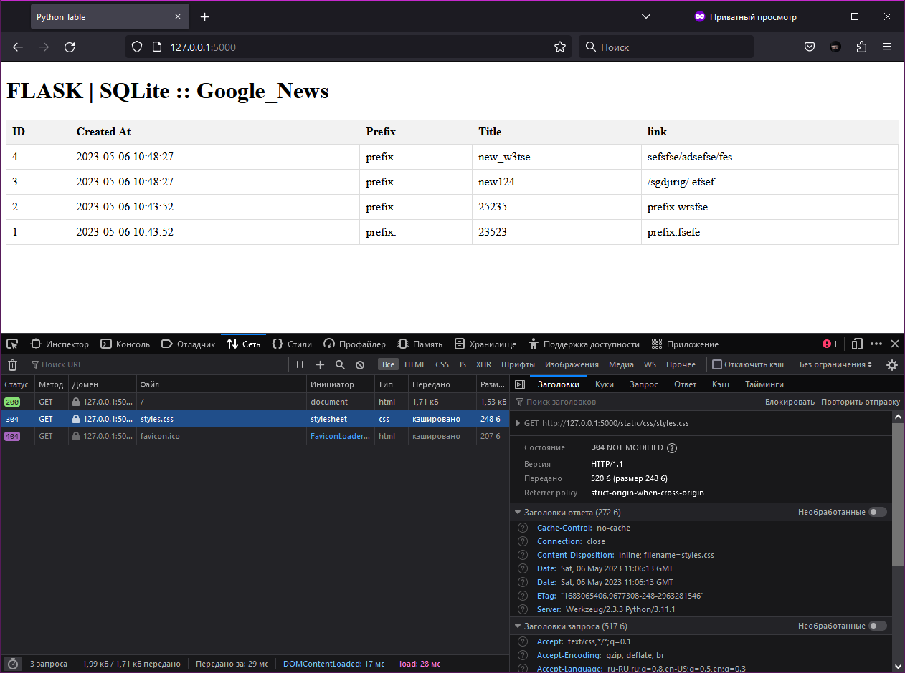

# F PARSER

FLASK

```
# Парсим HTML-код страницы с помощью BeautifulSoup
soup = BeautifulSoup(response.content, 'html.parser')
```
Эта строка кода парсит HTML-код страницы, которая была получена в ответ на запрос URL с использованием библиотеки requests, и создает объект BeautifulSoup для облегчения работы с HTML-кодом.

response.content содержит HTML-код страницы в виде байтового объекта, который передается в качестве первого аргумента в функцию BeautifulSoup().

Второй аргумент html.parser указывает, какой парсер использовать для обработки HTML-кода. Здесь мы используем стандартный парсер html.parser, встроенный в библиотеку BeautifulSoup.

После этого мы можем использовать различные методы и атрибуты объекта BeautifulSoup для поиска и извлечения данных из HTML-кода страницы.

## Beginning
