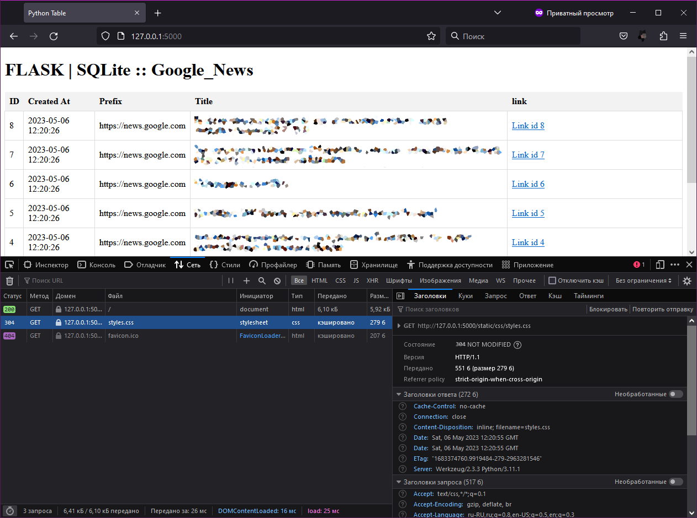
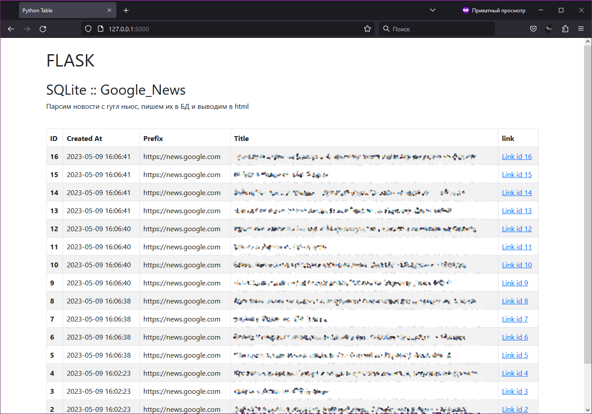

# F PARSER

`flask_app.py` - запускает приложение, которое читает из таблицы БД и выводит в index.

`parse_and_wright.py` - парсит и пишет в таблицу БД.

`delete4db.py` - удаляет все записи в таблице БД.

`db_tb_create.py` - создаёт БД с таблицей.

`wright2db.py` - пишет в таблицу БД.

`read4db.py` - читает из таблицы БД и выводит в терминал.

`google_nevs_pars.py` - собирает новости: ссылки и тайтлы; выводит в терминал.

`templates\index.html` - шаблон

`static\css\styles.css` - стиль

## Beginning

Без парсинга:

## It's works!

## Добавил Bootstrap

