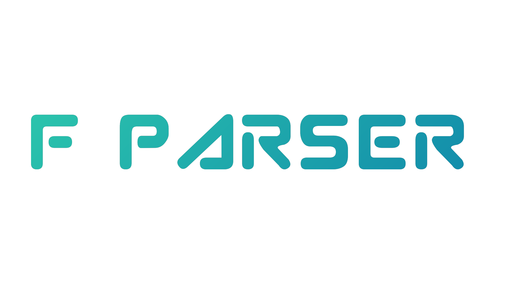

# F PARSER

`flask_app.py` - запускает приложение, которое читает из таблицы БД и выводит в index.

`parse_and_wright.py` - парсит и пишет в таблицу БД.

`delete4db.py` - удаляет все записи в таблице БД.

`db_tb_create.py` - создаёт БД с таблицей.

`wright2db.py` - пишет в таблицу БД.

`read4db.py` - читает из таблицы БД и выводит в терминал.

`google_nevs_pars.py` - собирает новости: ссылки и тайтлы; выводит в терминал.


## BeautifulSoup

```
# Парсим HTML-код страницы с помощью BeautifulSoup
soup = BeautifulSoup(response.content, 'html.parser')
```
Эта строка кода парсит HTML-код страницы, которая была получена в ответ на запрос URL с использованием библиотеки requests, и создает объект BeautifulSoup для облегчения работы с HTML-кодом.

response.content содержит HTML-код страницы в виде байтового объекта, который передается в качестве первого аргумента в функцию BeautifulSoup().

Второй аргумент html.parser указывает, какой парсер использовать для обработки HTML-кода. Здесь мы используем стандартный парсер html.parser, встроенный в библиотеку BeautifulSoup.

После этого мы можем использовать различные методы и атрибуты объекта BeautifulSoup для поиска и извлечения данных из HTML-кода страницы.

## Beginning

Без парсинга:


## It's work!

